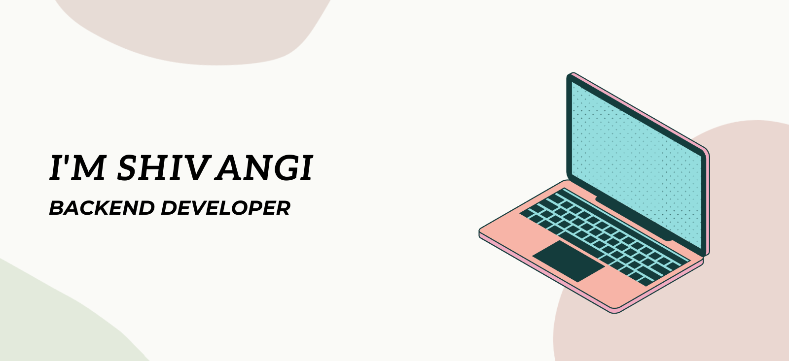

  

<h3 align="left">About me:</h3>

Hi there 👋
I am Shivangi, a backend developer
  
  - 🌱 I’m currently learning: **JavaScript and APIs**
  - ⚡ Fun fact: **I love reading novels**  

<h3 align="left">Languages and Tools:</h3>

  &nbsp;
  &nbsp;
  &nbsp;
   &nbsp;
  &nbsp;
  
  &nbsp;
  &nbsp;
  
  &nbsp;
  &nbsp;

<h3 align="left">Total views: </h3>

<h3 align="left">Connect with me:</h3>

  

   

<h3>My stats:</h3>

